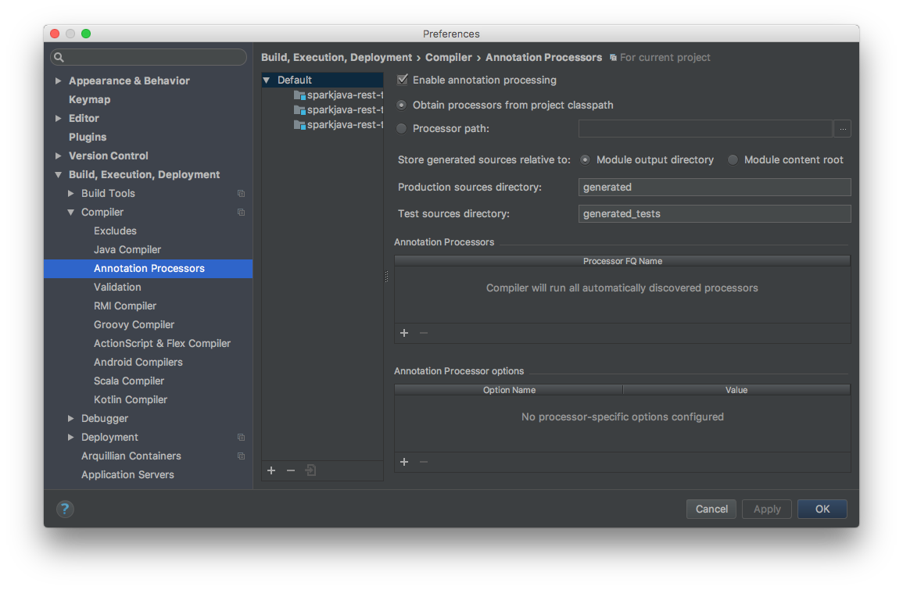

# Spark REST Template

[](https://travis-ci.org/michalkowol/sparkjava-template)
[](https://codecov.io/github/michalkowol/sparkjava-template?branch=master)


## Architecture

### Package By Feature

Package-by-feature uses packages to reflect the feature set. It tries to place all items related to a single feature (and only that feature) into a single directory/package. This results in packages with high cohesion and high modularity, and with minimal coupling between packages. Items that work closely together are placed next to each other. They aren't spread out all over the application. It's also interesting to note that, in some cases, deleting a feature can reduce to a single operation - deleting a directory. (Deletion operations might be thought of as a good test for maximum modularity: an item has maximum modularity only if it can be deleted in a single operation.)

Source: http://www.javapractices.com/topic/TopicAction.do?Id=205

### HTTP

Thread HTTP only as your transporting layer. Try to avoid leaking HTTP logic into your briskness logic. Utilize **domain-driven design**.

## Build

### Default

```bash
gradle
```

### Build

```bash
gradle build
```

### Run

```bash
gradle run
```

### Tests

```bash
gradle check
```

### Continuous tests

```bash
gradle test -t
```

or

```bash
gradle test --continuous
```

### Integration tests
    
```bash
gradle integrationTest
```

### FatJar

Sometimes you need to remove jars signatures:

`build.gradle`:

```groovy
// ...
task fatJar(type: Jar) {
    baseName = "${project.name}-assembly"
    manifest = jar.manifest
    exclude('META-INF/*.SF')
    exclude('META-INF/*.DSA')
    exclude('META-INF/*.RSA')
    from { configurations.compile.collect { it.isDirectory() ? it : zipTree(it) } }
    with jar
}
// ...
```

```bash
gradle fatJar

java -jar build/libs/${NAME}-assembly-${VERSION}.jar

java -Denvironment=dev -jar build/libs/${NAME}-assembly-${VERSION}.jar
java -Denvironment=qa -jar build/libs/${NAME}-assembly-${VERSION}.jar
java -Denvironment=staging -jar build/libs/${NAME}-assembly-${VERSION}.jar
java -Denvironment=production -jar build/libs/${NAME}-assembly-${VERSION}.jar
```

### Code coverage

```bash
gradle jacocoTestReport
open build/jacocoHtml/index.html
```

## PostgreSQL

### Docker

```bash
docker run --name softwareberg-postgres-db -p 5432:5432 -e POSTGRES_DB=softwareberg -e POSTGRES_USER=softwareberg -e POSTGRES_PASSWORD=softwareberg -d postgres:9.6
```

### Library

`build.gradle`:

```groovy
// ...
dependencies {
    // ...
    compile 'org.postgresql:postgresql:9.4.+'
    // ...
}
// ...
```

### Configuration

`application.properties`:

```properties
# ...
datasource.jdbcUrl=jdbc:postgresql://localhost:5432/softwareberg
datasource.username=softwareberg
datasource.password=softwareberg
# ...
```

## Heroku

### Test on local

```bash
heroku local web
```

### Deploy

```bash
heroku login
heroku create
git push heroku master
heroku logs -t
```

or

```bash
heroku git:remote -a NAME_OF_APP
git push heroku master
heroku logs -t
```

https://sparkjava-template.herokuapp.com/

## IntelliJ

Remember to turn on "Annotation Predecessors"



## Server side rendering

As server side rendering template I recommend [Thymeleaf](http://www.thymeleaf.org/) or (for very simple pages) [Mustache](https://mustache.github.io/).

To use Thymeleaf with Spark you need to include `Thymeleaf ResponseTransformer` in `build.gradle`

```groovy
compile 'com.sparkjava:spark-template-mustache:2.5.+'
```

and then add it to router

```java
// ...
ThymeleafTemplateEngine templateEngine = // ...
// ...
// hello.html file is in resources/templates directory
ImmutableMap.of("name", "Sam")
get("/hello", (request, response) -> new ModelAndView(map, "hello"), templateEngine);
// ...
```
